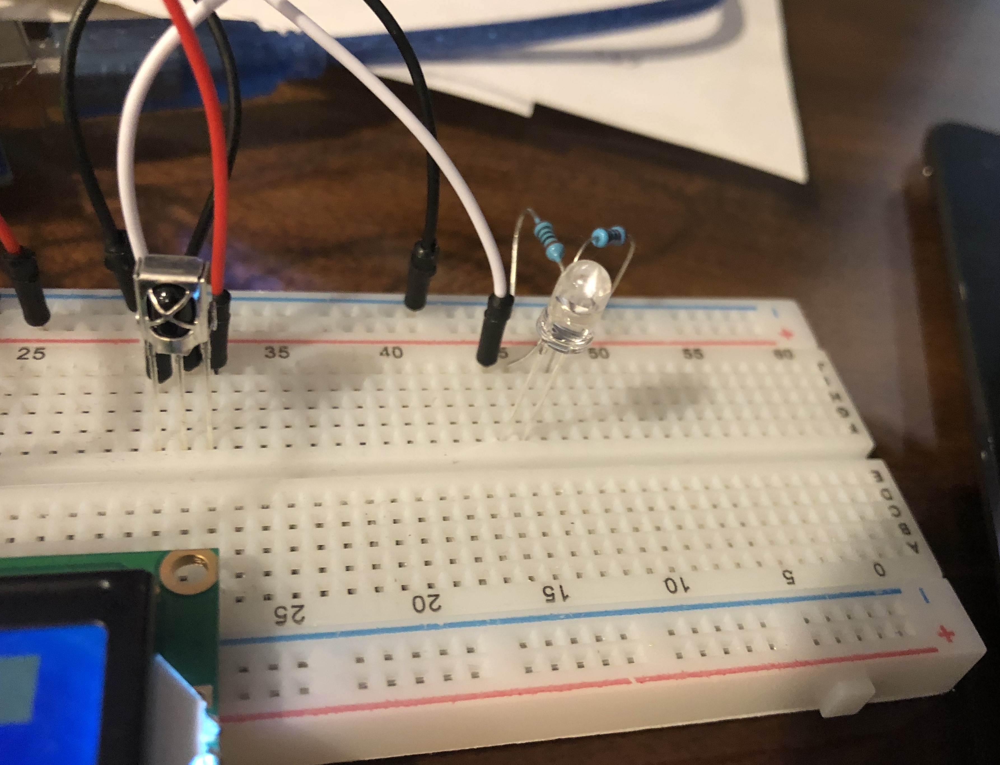
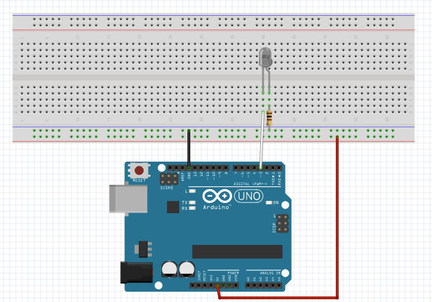
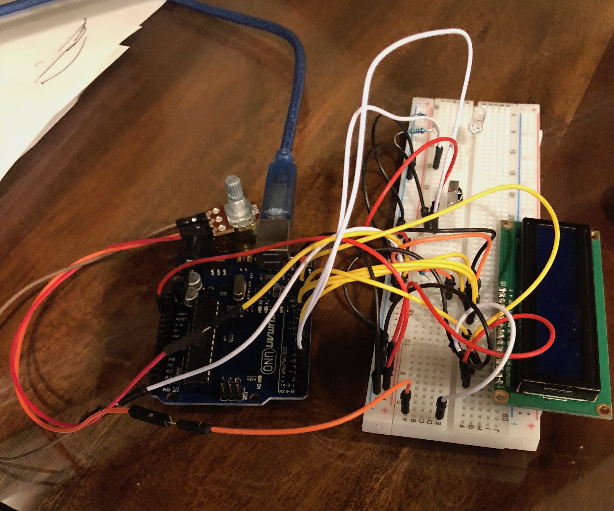
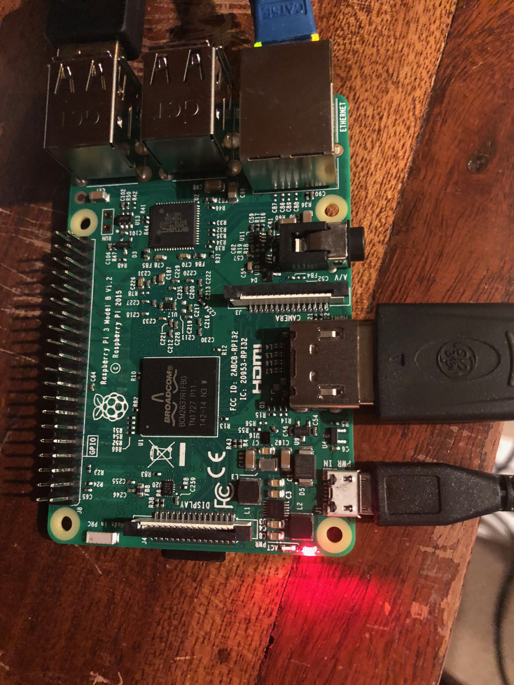

# Remote-As-A-Service
How to curse out not only your programming, but also radio waves.

**Group: Chandler Bachman, David Qiao**

[toc]

# Overview

This project has 5 Parts with communication methods between all of them. Here they are listed

* Television (TV)
* IR
* Arduino (Slave)
* Raspberry Pi (Master)
* Control

## Television
This is the simplest part of the project. The Television needs to be on and capable of receiving IR signals on the 940nm wavelength. For this project we used a Sony Television, and used the Volume Controls as a test subject, but any IR signal can be used as long as it can be recorded.

## IR

This IR LED communicates over IR to the Television.

You might want to use a more powerful IR LED than the one we have here, since this one has a range of about 3-5 inches at best. 



Here is the schematic. The IR led is hooked up to pin 3 on the Arduino since it supports PWM, which is needed for the IR LED to function.
There is a 100Ω resistor hooked up to prevent the IR LED from burning out.

## Arduino (Slave)
This is the control mechanism for the IR LED. It receives a Serial Signal over its USB port and decodes the signals sent to it from JSON to the IR commands which it will then send out.

It has two modes, learn and send. Learn mode is started with a `learn` message sent over serial. Send mode is started with a `send` message sent over serial. In learn mode it will ignore any signals sent to it except for `send` and will send back any IR signals it receives with the IR Receiver. In send mode it will take any JSON sent to it and try and decode the JSON into a signal to send with the IR LED.

The object sent back and forth is a JSON object with 3 fields: `protocol`, `value`, and `bits`. Protocol indicates the type (e.g., `Sony`, `Apple`), Value indicates the actual signal, and `bits` is the storage of any extra data needed to send the message. 



## Raspberry Pi (Master)
This is the central mechanism for the entire project. It handles storing the signals "learned", since the Raspberry Pi doesn't have enough SRAM to be able to. It also handles launching the WebServer and controlling the Raspberry Pi.

The webserver is done with [Node.js](https://nodejs.org/en/) and the actual serving of files done with [Express.js](https://expressjs.com). This was done because Node.js has a nice library for handling serial communication with an Arduino [Node-Serialport](https://node-serialport.github.io/node-serialport/) and can handle a webserver. All other languages struggled with one or the other. Kotlin couldn't handle communicating over serial port nicely, C can't do a webserver easily, Swift had trouble compiling at all. Speed isn't an important concern since the Raspberry Pi has more than enough resources for this project and the server spends most of its time waiting anyway. 



### Webserver
The webserver endpoints are as follows:

#### GET /web
This handles the web based remote control.

#### GET /learn
This turns the Arduino into `learn` mode and waits for one command. 
Immediately returns a 200 OK with a JSON object containing one field: `id`. This id contains the id for the command that will be used to check if it has been learned yet.
A name parameter can be passed into this to name the command.
While the Arduino is in `learn` mode, it will not send any IR Signals. This is the only exception to the otherwise totally RESTful api, since there isn't a way to not have the IR learning conflict with the IR sending. It shouldn't come up much, since there will only really be learning while setting up the remote.

#### GET /list/:id
Will return an empty body if the command doesn't exist, and a JSON representation if it doesn't exist.

#### GET /list
Will return the current list of commands in the format:

```javascript
[
	{
		name: "foo",
		_id: "PPBqWA9",
		command: {
			protocol: 2,
			value: 3312,
			bits: 0
		}
	}
]
```

#### DELETE /list/:id
Will delete the command with the passed in id.

#### GET /send/:id
Will send the command with the passed in id over IR.

## Control
This is the GUI presented to the user. The device only needs to be capable of sending HTTP Requests to write a custom GUI for the device, or to use the web GUI provided by the Raspberry Pi it has to be able to run a browser specified by the chart below. (Any decent browser updated in the last ~year will be able to run it)

![(CanIUse)[https://caniuse.com/#feat=async-functions]](docs/images/caniuse_async.png)
[Link to CanIUse](https://caniuse.com/#feat=async-functions)

The reason for this is because [async/await](https://developer.mozilla.org/en-US/docs/Web/JavaScript/Reference/Statements/async_function) really helped to manage non-blocking IO with the webpages, and if people don't update their browsers then I don't care about them using this product.

# Problems

## IR LED
The receiver actually worked correctly the first time. However, the IR LED took lots of trial and error to get work. It required exactly a 100Ω resistor, and had to be put in backwards, because the IR LED that I have has the short end and long end reversed. Any stronger resistor and it wouldn't emit a IR signal and any less and it would burn out.

## Arduino (Slave)
The Arduino ran into a couple of problems:

### Memory Limit
By far the hardest to debug (Mostly because I don't do embedded development) was running out of SRAM on the Arduino. It was especially hard to keep the SRAM usage below 2 kilobytes. Initially I had a 500 character buffer for the input, however this had to go because with only 2 kilobytes of SRAM I was quickly running out. I also removed the debug 2x16 display, since the software required for running it took up ~200 bytes of SRAM. As well, moving String Literals into Flash allowed me to save another ~100 bytes of SRAM. In the end, I was below the limit by ~200 bytes of SRAM at any given point in my program, and there was no evidence of any memory leaks.

### JSON Parsing Issues
Parsing the JSON took some working out. I ended up using [Arduino JSON](https://arduinojson.org) to handle the parsing, however even with that, I was running into a problem where a string literal stored on the Arduino for testing parsed correctly, but any JSON String I sent over Serial wouldn't parse correctly, even if they were the exact same string. I eventually found that even though both String Literals were created in the same place on the system, the string literal could be passed to another function, while the String Literal created in the function itself couldn't be passed by value, since the Arduino String class doesn't support pass by value or copy semantics. I had to change the parsing methods to use pass by reference. This as a side effect saved me allocating more RAM than I needed to in order to parse the JSON.

### IR Signal Parsing
I initially tried to parse the IR with a custom parser, which didn't work very well. It's difficult to parse IR signals coming over a wire into actual data. I quickly decided to move to a library to deal with the problem. I found [IRLib2](https://github.com/cyborg5/IRLib2) which handled the IR parsing problem very well. It takes a lot of SRAM, so it took a lot of optimization to fit into the SRAM budget for the project.

## Raspberry Pi (Master)
The Raspberry Pi ran into a couple of problems as well:

### Environment
The environment on the raspberry pi took a lot of decisions. For the OS I went with [Diet Pi](http://dietpi.com), because it would handle OpenSSH, NTSC Time Syncs and cron for me, while providing a simple minimalist Linux Distro to work on top of. Next I tried to install [Kotlin/Native](https://kotlinlang.org/docs/reference/native-overview.html). However, due to the beta status of Kotlin/Native I was unable to get it to work with any C libraries for Serial Communication with the Arduino. I then settled for [Node.js](https://nodejs.org/en/) to run the server. I was hesitant, because I had never written a Node.js module with Native Bindings to C before. However as so often happens in the node ecosystem, someone had already written one for me at [node-serialport](https://node-serialport.github.io/node-serialport/). This allowed me to quickly setup a Serial Connected and then tack on a Webserver and Database (Since I had already done those before it was relatively easy)

### RESTful API
I prefer to write servers with a [RESTful API](https://en.wikipedia.org/wiki/Representational_state_transfer). It makes writing a client extremely easy, since you don't have to sync the state of the server over Wi-Fi to all the clients, and they can just query whenever they need to. However, since the Arduino needs to be either in learn or send mode that wasn't possible. However, disregarding the `/learn` endpoint, I do have a totally RESTful API.

### Database
This wasn't much of a problem, because I have used [NeDB](https://github.com/louischatriot/nedb) before, so it wasn't hard to set it up in node and direct it to a file to auto save/load the database on start/exit of the process.

## Control
There was only 1 difficult issue here. Formatting the list of controls to have a delete button inside of it took some creative positioning of the elements inside each list-group element. In the end, each list-group item is a flexbox with 

# Resources

## Frameworks:
* [Node.js](https://nodejs.org/en/) - To run code on Master
* [PlatformIO](https://platformio.org) - To build/deploy to Slave
* [Chromium](https://www.chromium.org/Home) - To run web interface
* [Webkit](https://webkit.org) - To run web interface
* [Gecko](https://developer.mozilla.org/en-US/docs/Mozilla/Gecko) - To run web interface

## Libraries:
Node:

* [NeDB](https://github.com/louischatriot/nedb) - Database backing stored IR Commands
* [Node SerialPort](https://node-serialport.github.io/node-serialport/) - Communication with Slave
* [Express](https://expressjs.com) - Webserver
* [shortid](https://github.com/dylang/shortid) - Create unique ids for commands

Arduino:

* [ArduinoJson](https://arduinojson.org) - Parse JSON on Arduino
* [IRLib2](https://github.com/cyborg5/IRLib2) - Manage IR LED and IR Receiver
* [MemoryFree](https://github.com/McNeight/MemoryFree) - Check available memory on Arduino

Web Interface:

* [Bootstrap 4](https://getbootstrap.com) - Grid Layout / General Components
* [jQuery](https://jquery.com) - Manage editing webpage
* [Font Awesome](https://fontawesome.com) - Icon for Trash Can
* [Popper.js](https://popper.js.org) - Dependency of Bootstrap

## Other:
Fonts:

* [San Francisco](https://developer.apple.com/fonts/) - To type this report
* [Inconsolata](http://levien.com/type/myfonts/inconsolata.html) (Seriously the best font) - To type code

Tutorials:
If we don't count the documentation pages on the official webpages, then I didn't use any tutorials.

Amazon Purchases:

* [Resistors](https://www.amazon.com/gp/product/B072BL2VX1/) - 100Ω resistor
* [IR LED](https://www.amazon.com/gp/product/B01BVGIZGC/) - IR LED

Programs:

* [DietPi](http://dietpi.com) - OS for Master
* [Atom](https://atom.io) - Text Editor for both Arduino and Raspberry Pi
* [Mountain Duck](https://mountainduck.io) - Develop on SFTP Mount on Raspberry Pi
* [Alfred 3](https://www.alfredapp.com) - General Productivity
* [MacDown](https://macdown.uranusjr.com) - Type this report
